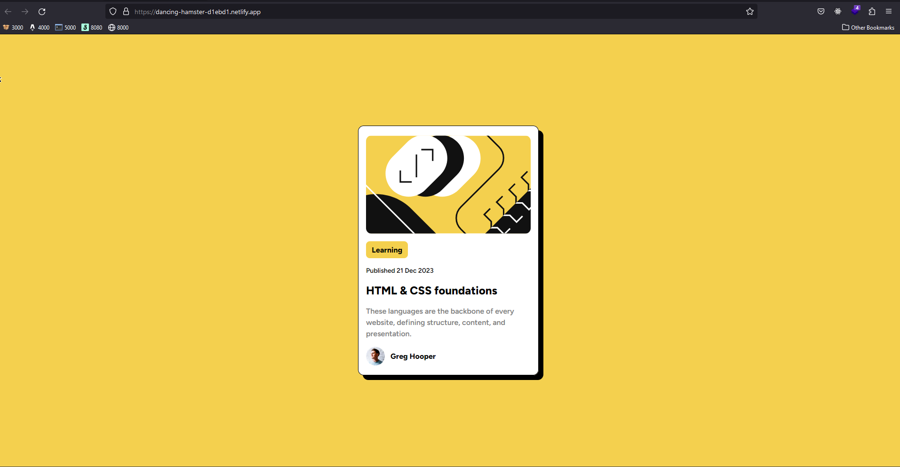

# Frontend Mentor - Blog preview card solution

This is a solution to the [Blog preview card challenge on Frontend Mentor](https://www.frontendmentor.io/challenges/blog-preview-card-ckPaj01IcS). Frontend Mentor challenges help you improve your coding skills by building realistic projects. 

## Table of contents

- [Frontend Mentor - Blog preview card solution](#frontend-mentor---blog-preview-card-solution)
  - [Table of contents](#table-of-contents)
  - [Overview](#overview)
    - [Screenshot](#screenshot)
    - [Links](#links)
  - [My process](#my-process)
    - [Built with](#built-with)
    - [Continued development](#continued-development)
  - [Author](#author)

## Overview

### Screenshot

### Links

- Solution URL: [Github](https://github.com/sreekarnv/fm-blog-preview-card)
- Live Site URL: [Netlify](https://dancing-hamster-d1ebd1.netlify.app/)

## My process

### Built with

- Semantic HTML5 markup
- Flexbox
- [TailwindCSS](https://tailwindcss.com/) - UI Library
- [Parcel.js](https://parceljs.org/) - Bundler

### Continued development

Use this section to outline areas that you want to continue focusing on in future projects. These could be concepts you're still not completely comfortable with or techniques you found useful that you want to refine and perfect.

## Author

- Website - [Sreekar Venkata Nutulapati](https://sreekarnutulapati.vercel.app)
- Frontend Mentor - [@sreekarnv](https://www.frontendmentor.io/profile/sreekarnv)

